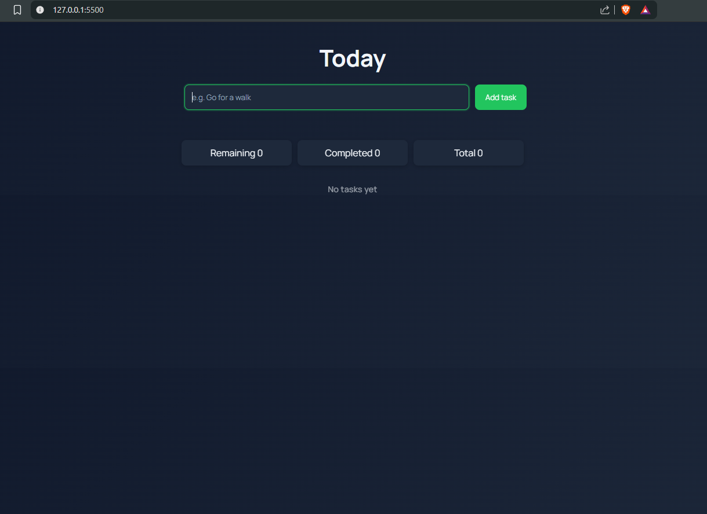
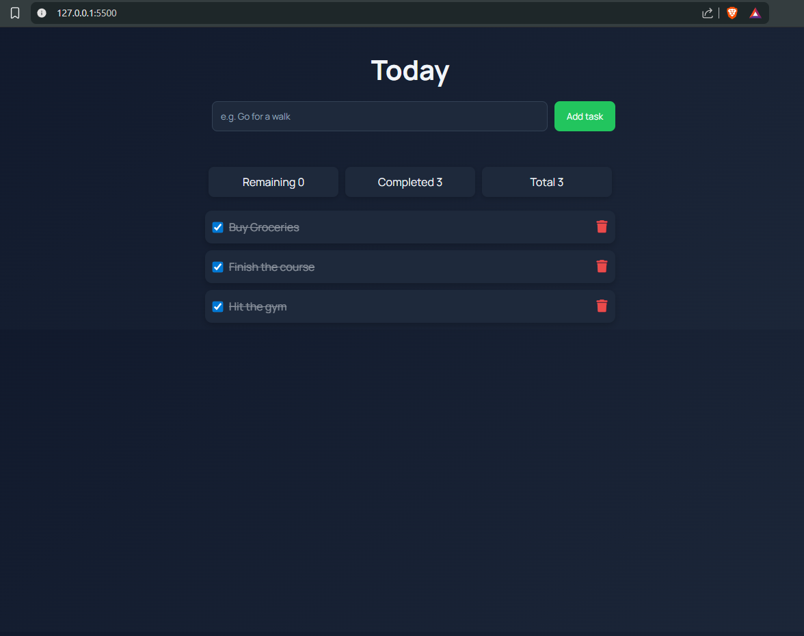
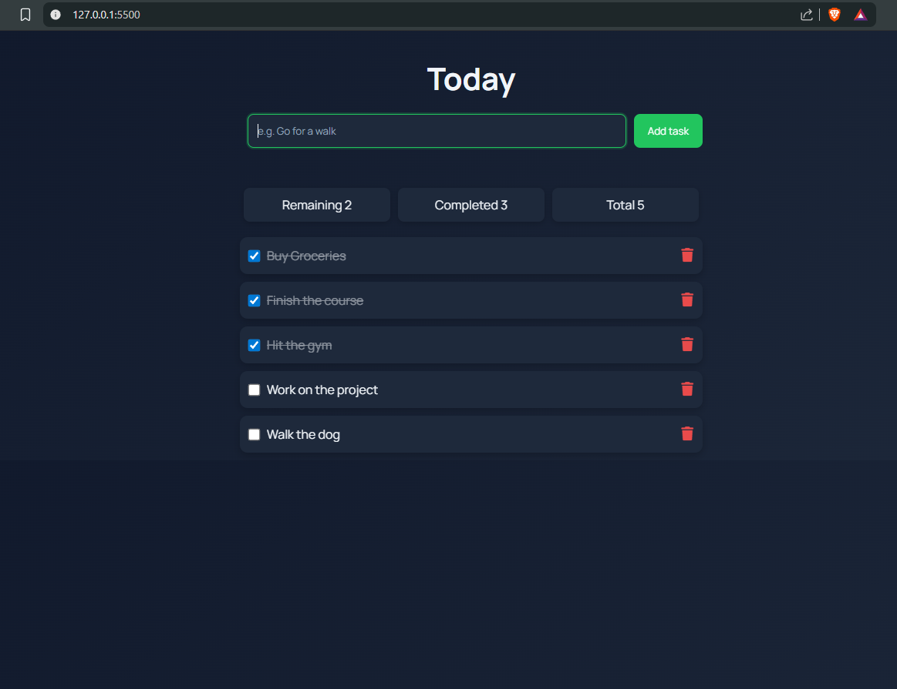
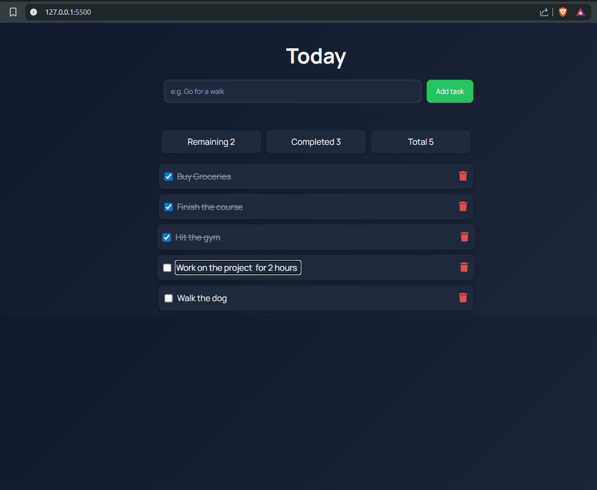

# To-Do App

A modern and interactive task management web application built using **HTML, CSS, and JavaScript**.
This app allows users to manage daily tasks efficiently with real-time updates and persistent storage.

## Features

* Add new tasks
* Delete tasks
* **Inline task editing** (click on a task to edit)
* Mark tasks as completed
* Dynamic task statistics (Total / Completed / Remaining)
* Persistent storage using `localStorage`
* Empty state handling
* Smooth animations and responsive UI

## Tech Stack

* **HTML5** → Structure
* **CSS3** → Styling & Animations
* **JavaScript (ES6+)** → Logic & Interactivity
* **localStorage API** → Data persistence

## Screenshots

### Empty State



### Adding Tasks


### Completed Tasks



### Task Statistics
#### Remaining - 2  Completed - 3 Total - 5


### Inline Editing

Click on any task to edit it directly.


## How It Works

Tasks are stored as objects:

```json id="o8q3k1"
{
  "id": 1690000000000,
  "name": "Buy groceries",
  "isCompleted": false
}
```

### Data Flow

```text id="9u7kq2"
User Input → Update Tasks Array → Save to localStorage → Update UI
```

## Key Concepts Used

* DOM Manipulation
* Event Delegation
* State Management (Array + localStorage)
* Dynamic Rendering
* Conditional Styling
* Inline Editing using `contenteditable`

## Setup & Usage

1. Clone the repository

```bash id="k9f2d1"
git clone https://github.com/your-username/todo-app.git
```

2. Open the project folder

3. Run `index.html` in your browser


## Future Improvements

* Task filtering (All / Completed / Pending)
* Due dates and priority levels
* Backend integration (Firebase / API)
* React version for scalability

## License

This project is open-source and available under the **MIT License**.

## Acknowledgements

Inspired by modern productivity tools like **Todoist** and **Notion**.

## Author

**Shreya Jadhav**
